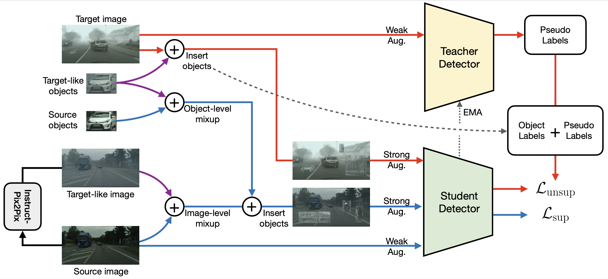

# CropAT

This repo is the official implementation of our WACV 2026 paper:

**CropAT: Leveraging Diffusion-Generated Target-Like Cropped Objects for Pseudo-Label Refinement in Domain-Adaptive Object Detection**

Chen-Che Huang, Tzuhsuan Huang, Jun-Cheng Chen



# Installation

1. Follow [instruct-pix2pix](https://github.com/timothybrooks/instruct-pix2pix) to setup a conda environment `ip2p`.
2. Follow [AT](https://github.com/facebookresearch/adaptive_teacher) to install the environment `at` with the required libraries.

# Download Datasets

1. Download Cityscapes and Foggy Cityscapes datasets from the [official website](https://www.cityscapes-dataset.com).
2. Download PASCAL VOC 2007 and 2012 datasets from the [official website](http://host.robots.ox.ac.uk/pascal/VOC/voc2007/#devkit).
3. Clone the repo [cityscapes-c](https://github.com/ekellbuch/cityscapes-c) and follow the instruction to corrupt the Cityscapes dataset.
4. Download Clipart1k dataset provided by the work [Cross-Domain Weakly-Supervised Object Detection through Progressive Domain Adaptation](https://github.com/naoto0804/cross-domain-detection/tree/master).
5. Download Single-DGOD dataset collected by the work [Single-Domain Generalized Object Detection in Urban Scene via Cyclic-Disentangled Self-Distillation](https://github.com/AmingWu/Single-DGOD).

# Directory Structure

1. After cloning the repo [instruct-pix2pix](https://github.com/timothybrooks/instruct-pix2pix), move all files and directory under `instruct_pix2pix_stuff` into the repo directory `instruct-pix2pix`.
2. The model’s VGG backbone is initialized using the converted weights from [CMT](https://github.com/Shengcao-Cao/CMT). Please the download the weights under the directory `checkpoints`.

Please structure your directories in the following manner:

```
instruct-pix2pix/
├── scripts/
├── train_learnable_prompt.py
├── edit_cli_all_images.py
└── ... (other original files of the repo `instruct-pix2pix`)

CropAT/
├── cropat/
├── checkpoints/
    └── vgg16_bn-6c64b313_converted.pth
├── scripts/
├── train_net.py
└── datasets/
    ├── cityscapes/
    ├── cityscapes_foggy/
    ├── cityscapes_c/
        ├── bightness-5/
        ├── fog-5/
        ├── frost-5/
        └── snow-5/
    ├── VOC2007/
    ├── VOC2012/
    ├── clipart/
    └── sdgod/
        ├── daytime_sunny/
        ├── daytime_foggy/
        ├── dusk_rainy/
        ├── night_sunny/
        └── night_tainy/
```

# Training

### Cityscapes $\rightarrow$ Foggy Cityscapes

1. Train the learnable prompt

    ```bash
    cd instruct-pix2pix

    # activate ip2p environment
    conda activate ip2p

    # start training
    bash scripts/train_learnable_prompt_c2fc.sh

    # edit the all source images into target-like images
    bash scripts/edit_cli_all_image_c2fc.sh
    ```

2. Generate object crops

    ```bash
    cd CropAT

    # crop the source images according to its annotations
    python crop_box.py \
        --img-dir datasets/cityscapes/leftImg8bit/train \
        --ann-path datasets/cityscapes/annotations/cityscapes_train.json

    # crop the target-like images according to the source annotations
    python crop_box.py \
        --img-dir datasets/target_like/c2fc/leftImg8bit/train \
        --ann-path datasets/cityscapes/annotations/cityscapes_train.json
    ```

3. Tain the detector

    ```bash
    cd CropAT

    # activate AT environment
    conda activate at

    # start training
    bash scripts/train_detector_c2fc.sh
    ```

### PASCAL VOC $\rightarrow$ Clipart1k

1. Train the learnable prompt

    ```bash
    cd instruct-pix2pix

    # activate ip2p environment
    conda activate ip2p

    # start training
    bash scripts/train_learnable_prompt_voc2clipart.sh

    # edit the all source images (VOC2007, VOC2012) into target-like images
    bash scripts/edit_cli_all_image_voc2clipart.sh
    ```

2. Generate object crops

    ```bash
    cd CropAT

    # crop the source images (VOC2007) according to its annotations
    python crop_box_voc.py \
        --voc-dir datasets/VOC2007/ \
        --ann-dir datasets/VOC2007/Annotations \
        --img-list-file datasets/VOC2007/ImageSets/Main/trainval.txt

    # crop the source images (VOC2012) according to its annotations
    python crop_box_voc.py \
        --voc-dir datasets/VOC2012/ \
        --ann-dir datasets/VOC2012/Annotations \
        --img-list-file datasets/VOC2012/ImageSets/Main/trainval.txt

    # crop the target-like images according to the source annotations
    python crop_box_voc.py \
        --voc-dir datasets/target_like/voc2007_to_clipart \
        --ann-dir datasets/VOC2007/Annotations \
        --img-list-file datasets/VOC2007/ImageSets/Main/trainval.txt
    python crop_box_voc.py \
        --voc-dir datasets/target_like/voc2012_to_clipart \
        --ann-dir datasets/VOC2012/Annotations \
        --img-list-file datasets/VOC2012/ImageSets/Main/trainval.txt
    ```

3. Tain the detector

    ```bash
    cd CropAT

    # activate AT environment
    conda activate at

    # start training
    bash scripts/train_voc2clipart.sh
    ```


# Model Weights

| Source Domain | Target Domain | mAP (AP50) | Weights |
| :-----------: | :-----------: | :--------: | :-----: |
| Cityscapes | Foggy Cityscapes | 53.2 | Link |
| Cityscapes | Cityscapes-C (Brightness) | 54.2 | Link |
| Cityscapes | Cityscapes-C (Fog) | 53.8 | Link |
| Cityscapes | Cityscapes-C (Frost) | 42.0 | Link |
| Cityscapes | Cityscapes-C (Snow) | 44.3 | Link |
| PASCAL VOC | Clipart1k | 52.2 | Link |
| Daytime Sunny | Daytime Foggy | 41.2 | Link |
| Daytime Sunny | Dusk Rainy | 52.9 | Link |
| Daytime Sunny | Night Sunny | 44.4 | Link |
| Daytime Sunny | Night Rainy | 33.6 | Link |

# Citation

```BibTeX
@inproceedings{huang2026cropat,
  title={CropAT: Leveraging Diffusion-Generated Target-Like Cropped Objects for Pseudo-Label Refinement in Domain-Adaptive Object Detection},
  author={Chen-Che Huang, Tzuhsuan Huang, Jun-Cheng Chen},
  booktitle={IEEE/CVF Conference on Winter Conference on Applications of Computer Vision (WACV)},
  year={2026}
}
```
